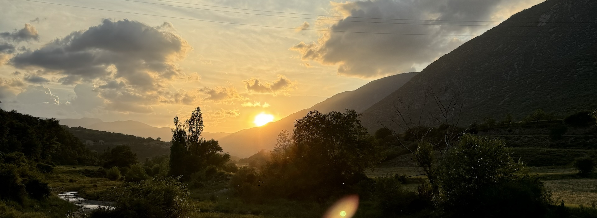

# REPOSITORIO DE NIKO VILLAR

Actualmente estudiante de:
- 💻 Tecnico Superior de Desarollo de Aplicaciones Multiplataforma
- 🌏 Estudiante de Grado en Geografía y Ordenación del Territorio
  
<!--
**nikovillarc/nikovillarc** is a ✨ _special_ ✨ repository because its `README.md` (this file) appears on your GitHub profile.

Here are some ideas to get you started:
- Estudiante de Tecnico de Desarollo Multiplataforma
- Estudiante de Grado en Geografía y Ordenación del Territorio

- 🔭 I’m currently working on ...
- 🌱 I’m currently learning ...
- 👯 I’m looking to collaborate on ...
- 🤔 I’m looking for help with ...
- 💬 Ask me about ...
- 📫 How to reach me: ...
- 😄 Pronouns: ...
- ⚡ Fun fact: ...
-->
